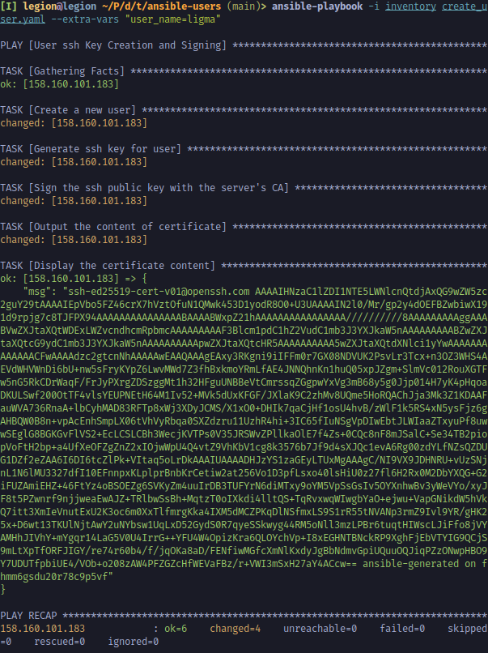
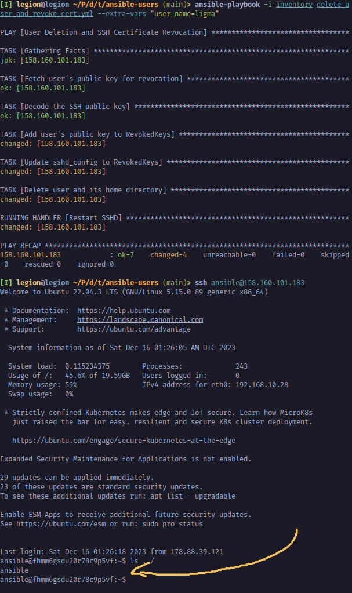

# DevoOps Assignment #7
## setup_ssh_ca.yml
Initial playbook for creating initial SSH Certificate Authority Setup. 
Tasks:
 - Create ssh CA directories
Creates 2 directories for newly generated ca_keys and trusted.
 - Generate ssh CA private key
 Creates pair of ssh CA keys of ed25519 type
 - Update sshd_config to trust CA
 Add to sshd_config previously created key to TrustedUserCAKeys to tell the server that it should trust certificates

## create_user.yaml
Usage with `user_name` var
```
$ ansible-playbook -i inventory create_user.yaml --extra-vars "user_name=ligma"
```
Tasks:
 - Create a new user
 Creation of new user with home directory
 - Generate ssh key for user
 Creation of ssh key pair of ed25519 type
 - Sign the ssh public key with the server's CA
 For signing key used community.crypto.openssh_cert library. In our case used User type of certificate.
 - Output the content of certificate
 Firstly output is registered to a variable `cert_content` via cat.
 - Display the certificate content
 After `debug` module is used to print.


## delete_user_and_revoke_cert.yml
As `create_user.yaml` require `user_name` var
```
$ ansible-playbook -i inventory delete_user_and_revoke_cert.yml --extra-vars "user_name=ligma"
```
Tasks:

 - Fetch user's public key for revocation
`slurp` module encodes the content in base64.
 - Decode the SSH public key
 Decode from base64 and store in variable `decoded_key`.
 - Add user's public key to RevokedKeys
One of the method to revoke ssh certificate is to storing revocation list. Keys can be revoked by adding them to the `/etc/ssh/revoked_keys` .
 - Update sshd_config to RevokedKeys
 Also need to specify the file name in the `sshd_config` file as TrustedUserCAKeys.
 - Delete user and its home directory
Complete deletion of user and it's home directory.

